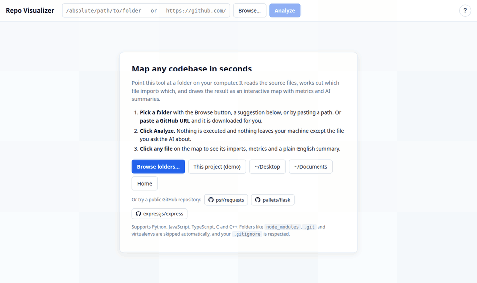
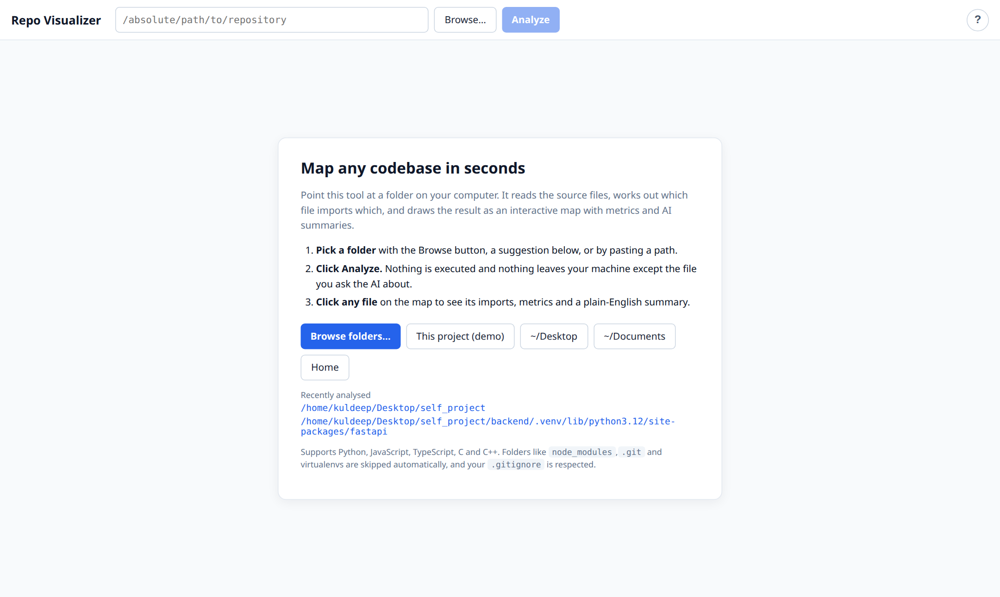
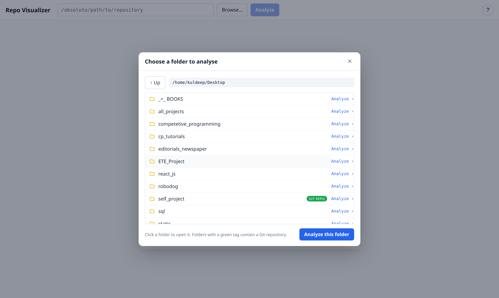
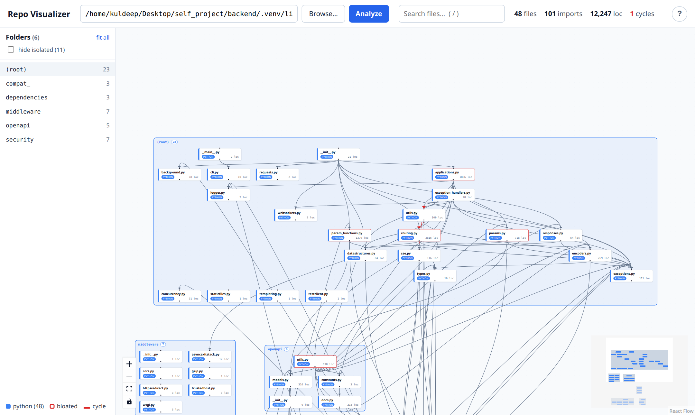
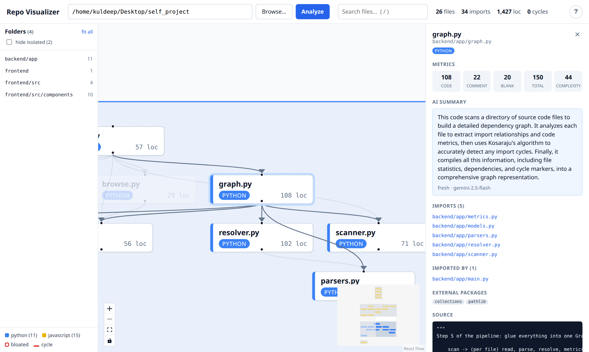

# Repo Visualizer

**See how a codebase fits together.** Point Repo Visualizer at a folder on your computer, or paste the URL of
any public GitHub repository, and it draws an interactive map of the files, the imports between them, how big
and complex each file is, and which files import each other in a loop. Click a file and an AI explains it in
three sentences.

It runs entirely on your machine. Nothing is executed and nothing is uploaded, except the single file you
choose to send to the AI.



## Contents

- [Features](#features)
- [Quick start](#quick-start)
- [User guide](#user-guide)
  - [1. Choose a folder or a GitHub URL](#1-choose-a-folder-or-a-github-url)
  - [2. Read the map](#2-read-the-map)
  - [3. Get around](#3-get-around)
  - [4. Inspect a file](#4-inspect-a-file)
  - [5. AI summaries](#5-ai-summaries)
  - [6. Large folders](#6-large-folders)
  - [Keyboard shortcuts](#keyboard-shortcuts)
- [How it works](#how-it-works)
- [API reference](#api-reference)
- [Configuration](#configuration)
- [Troubleshooting](#troubleshooting)
- [Adding a language](#adding-a-language)
- [Project structure](#project-structure)

## Features

- **Dependency map** for Python, JavaScript, TypeScript, C and C++, built by static analysis. Your code is read, never run.
- **Analyse by URL.** Paste `https://github.com/owner/repo` and the repository is downloaded (latest commit only) and mapped. Works for any public Git host with GitHub-style URLs. Downloads are listed with their size and can be removed in one click.
- **Folder boxes.** Files sit inside the folder they belong to, so the map mirrors the repository layout.
- **Interactive canvas.** Drag, zoom, minimap, click a folder to zoom to it, click a file to fade everything unrelated.
- **Metrics per file.** Code, comment and blank line counts plus cyclomatic complexity. Oversized files are outlined in red.
- **Import cycle detection.** Files that import each other in a loop are connected by red dashed arrows.
- **Side panel** with metrics, what a file imports, what imports it, external packages and a source preview.
- **AI summaries** through Google Gemini, cached by file content so an unchanged file is never sent twice.
- **Folder picker, search, recent repositories, hide-isolated toggle** and a built-in help dialog.
- Honours `.gitignore` and skips `node_modules`, virtualenvs, build output and binary files automatically.

## Quick start

You need **Python 3.11 or newer** and **Node 18 or newer**. Check with `python3 --version` and `node --version`.

### Linux and macOS

```bash
git clone https://github.com/Kuldeep-IITR/repo-visualizer.git
cd repo-visualizer
./run.sh
```

The first run installs everything (it calls `setup.sh` for you), then starts the backend on port 8000 and the
app on port 5173. Open **http://localhost:5173**. Press `Ctrl+C` in that terminal to stop both.

### Windows

Run these in PowerShell from the project folder:

```powershell
python -m venv backend\.venv
backend\.venv\Scripts\pip install -r backend\requirements.txt
copy backend\.env.example backend\.env
cd frontend; npm install; cd ..
```

Then open two terminals:

```powershell
# terminal 1 – backend
cd backend
.venv\Scripts\uvicorn app.main:app --reload --port 8000

# terminal 2 – frontend
cd frontend
npm run dev
```

Open **http://localhost:5173**.

### Optional: enable AI summaries

1. Get a free key at https://aistudio.google.com/apikey (no card needed).
2. Open `backend/.env` and replace `your_key_here` with the key.
3. Restart the backend.

Everything else works without a key. The "Explain with AI" button simply tells you the key is missing.

## User guide

### 1. Choose a folder or a GitHub URL



The welcome screen gives you four ways in:

- **Browse folders…** opens a folder picker. Click a folder to open it, and click *Analyze* next to the one you
  want. Folders that contain a Git repository are tagged in green.
- **Suggestions** such as *This project (demo)*, `~/Desktop` or *Home*. The demo analyses Repo Visualizer's own
  source, which is a good first look.
- **Paste a path** into the box at the top. It must be an absolute path such as `/home/you/projects/app`
  or `C:\Users\you\projects\app`.
- **Paste a GitHub URL** such as `https://github.com/psf/requests`, or pick one of the example repositories.

Folders and URLs you have analysed before appear under *Recently analysed*, and the last one is remembered
between visits.

**How URLs work.** The repository is shallow-cloned (only the latest commit, no history) into
`backend/repos/`, then analysed like any local folder. The first analysis waits for the download, which
takes a few seconds to a minute depending on the repository and your connection. After that the clone is
reused, so re-analysing is instant. A badge in the top bar shows the repository name and the commit hash;
its **↻** button downloads the latest commit and analyses again.

- Public repositories only. A private or non-existent repository gives a clear error instead of a login prompt.
- A specific branch works too: `https://github.com/owner/repo/tree/branch-name`.
- GitLab (`…/-/tree/branch`) and Bitbucket URLs of the same shape are accepted.

**Removing downloads.** Nothing is deleted automatically. When you no longer need a repository:

- press the **🗑** button in the top-bar badge while it is open, or
- use the **Downloaded repositories** list on the welcome screen, which shows every download with its size on
  disk and offers *remove* per repository and *Remove all*.

Either way you are asked to confirm, and the repository can be downloaded again at any time. Deleting the
`backend/repos/` folder by hand does the same thing.



Analysis takes well under a second for a typical project and a few seconds for very large ones.

### 2. Read the map



| You see | It means |
|---|---|
| A **card** | One source file. The coloured left edge is its language, the number is its lines of code. |
| A **box** with a name | A folder. Its files are inside. The tint is the folder's dominant language. |
| An **arrow** from A to B | A imports B. Only imports that point at a file inside the analysed folder become arrows. |
| A **red outline** on a card | A bloated file: more than 500 lines of code or complexity above 50. A good candidate for splitting. |
| A **red dashed arrow** | A circular import. The two files depend on each other, directly or through other files. |
| The **number in a box label** | How many files the folder holds. |

The strip at the top shows totals: files, imports, lines of code and the number of import cycles. Hover any
number for a definition. The legend in the bottom-left corner lists the language colours.

Packages that are not part of the folder, such as `react`, `numpy` or `<stdio.h>`, never become arrows. They are
listed per file in the side panel under *External packages*.

### 3. Get around

- **Pan** by dragging the background, **zoom** with the scroll wheel or the `+` / `–` buttons.
- **Folder list** on the left. Click any folder to zoom straight to it. *Fit all* zooms back out.
- **Click a folder box** on the canvas to zoom to it.
- **Search** at the top zooms to every file whose path contains what you type and fades the rest.
- **Hide isolated** removes files that neither import nor are imported by anything. On a folder full of
  unrelated scripts this clears most of the clutter.
- **Drag cards** to rearrange them. Positions stay put while you click around.
- The **minimap** in the bottom-right corner shows where you are. Drag it to move.

### 4. Inspect a file



Click a card. Everything unrelated fades, the file's neighbours stay bright, and the side panel opens:

- **Metrics**: code, comment, blank and total lines, and cyclomatic complexity. Hover for definitions.
- **Imports** and **Imported by**: clickable lists. Clicking one selects that file and pans to it, so you can
  walk through a chain of dependencies without touching the canvas.
- **External packages** the file uses.
- **Source** preview of the file.

Press `Esc` or the × to close the panel.

### 5. AI summaries

Press **Explain with AI** in the side panel. The file's text is sent to Gemini with the prompt
*"Explain what this code does in 3 simple sentences"* and the answer appears in the panel.

- The first request for a file takes a few seconds and is marked **fresh**.
- The answer is cached in `backend/summaries.db`, keyed by a hash of the file's content. Asking again is
  instant and marked **from cache**. Editing the file, even by one character, produces a fresh summary.
  Renaming or moving it does not.
- Very large files are truncated before sending.
- If the free tier's rate limit is hit you get a clear message and a *retry* link.

To clear the cache, delete `backend/summaries.db`.

### 6. Large folders

The scanner stops at **1,500 source files** to keep the map usable, and shows a yellow *Partial map* banner
when that happens. Analyse a sub-folder for the complete picture. Folders named `node_modules`, `.git`,
`venv`, `dist`, `build` and similar are skipped before counting, and so is anything matched by the
folder's `.gitignore`.

### Keyboard shortcuts

| Key | Action |
|---|---|
| `/` | Focus the search box |
| `Esc` | Close the side panel or any dialog |
| `?` | Open the help dialog |

The **?** button in the top-right corner opens the same help inside the app.

## How it works

```
 browser (React + React Flow)                    backend (FastAPI, Python)
 ┌──────────────────────────┐    JSON     ┌────────────────────────────────────┐
 │ Welcome / RepoInput      │ ◄────────── │ /api/suggestions, /api/browse      │
 │        ▼                 │             │                                    │
 │ GraphCanvas ◄─ layout.js │ ◄────────── │ /api/analyze                       │
 │        │                 │             │   scanner ─► parsers ─► resolver   │
 │        ▼                 │             │        └─► metrics ─► graph (SCC)  │
 │ SidePanel                │ ◄────────── │ /api/file      (source preview)    │
 │                          │ ◄────────── │ /api/summarize (Gemini + SQLite)   │
 └──────────────────────────┘             └────────────────────────────────────┘
```

The backend runs one file at a time through a small pipeline:

| Module | Job |
|---|---|
| `scanner.py` | Walk the folder, prune ignored directories *before* descending into them, apply `.gitignore`, skip binaries and files over 1 MB. |
| `parsers.py` | Pull out import statements. Python uses the built-in `ast` module, so strings that look like imports are ignored. JS/TS and C use regular expressions. |
| `resolver.py` | Turn `from app.x import y`, `./utils` or `"foo.h"` into a real file in the folder, or mark it external. Pure set lookups, no disk access. |
| `metrics.py` | Line counts and cyclomatic complexity (`radon` for Python, a decision-keyword count for other languages). |
| `graph.py` | Assemble nodes and edges, then find import cycles with Kosaraju's strongly-connected-components algorithm. |
| `ai.py` | Call Gemini behind a SQLite cache keyed by the SHA-256 of the file content. |
| `state.py` | Remember the last analysis. The file and summarize endpoints only accept ids that came out of the scanner, which rules out path traversal. |

The frontend lays the graph out in two levels (`layout.js`): inside each folder, files that import each other go
through dagre and files with no imports are packed into a compact grid. The folders are then laid out the same
way using folder-to-folder imports. This is what keeps a folder of fifty unrelated scripts a tidy block instead
of a fifty-wide line.

## API reference

Interactive docs with a "try it" button are at **http://localhost:8000/docs** while the backend runs.

| Method | Path | Input | Returns |
|---|---|---|---|
| GET | `/api/health` | | `{ "status": "ok" }` |
| GET | `/api/suggestions` | | `[{ label, path }]` starting points for the welcome screen |
| GET | `/api/browse` | `?path=/abs/dir` (optional, defaults to home) | `{ path, parent, entries: [{ name, path, is_repo }] }` |
| POST | `/api/analyze` | `{ "path": "/abs/dir" }` or `{ "path": "https://github.com/o/r", "refresh": false }` | `{ root, source_url, commit, stats, nodes[], edges[] }` |
| GET | `/api/file` | `?path=src/main.py` | `{ path, content, truncated }` |
| POST | `/api/summarize` | `{ "path": "src/main.py" }` | `{ summary, cached, model }` |
| GET | `/api/clones` | | `[{ id, url, path, commit, size_bytes, cloned_at }]` downloaded repositories |
| DELETE | `/api/clones` | `?id=github.com/owner/repo` or `?all=true` | `{ removed[], freed_bytes }` |

A node looks like this:

```json
{
  "id": "src/main.py", "label": "main.py", "path": "src/main.py", "language": "python",
  "loc": { "total": 120, "code": 90, "comment": 10, "blank": 20 },
  "complexity": 7, "bloated": false, "external_imports": ["fastapi", "os"]
}
```

An edge is `{ "id": "a.py->b.py", "source": "a.py", "target": "b.py", "circular": false }`, pointing from the
importer to the imported file. `stats` carries `files`, `edges`, `total_loc`, `cycles`, `languages`,
and `truncated` (true when the 1,500-file cap was hit). For a URL, `source_url` echoes the URL, `commit`
is the short hash that was analysed and `clone_id` is the handle for `DELETE /api/clones`; `refresh: true`
discards the cached clone first.

## Configuration

| Where | Setting | Default | Effect |
|---|---|---|---|
| `backend/.env` | `GEMINI_API_KEY` | unset | Enables AI summaries. |
| `backend/.env` | `GEMINI_MODEL` | `gemini-2.5-flash` | Any Gemini model name. |
| `frontend/.env` | `VITE_API_URL` | `http://localhost:8000/api` | Where the app looks for the backend. |
| `backend/app/scanner.py` | `MAX_FILES` | `1500` | File cap per analysis. |
| `backend/app/scanner.py` | `MAX_FILE_BYTES` | `1000000` | Files larger than this are skipped as generated. |
| `backend/app/scanner.py` | `DEFAULT_IGNORED_DIRS` | `node_modules`, `.git`, … | Folders never scanned. |
| `backend/app/metrics.py` | `BLOATED_LOC`, `BLOATED_COMPLEXITY` | `500`, `50` | Thresholds for the red outline. |
| `backend/app/ai.py` | `MAX_AI_CHARS` | `40000` | Text sent to the AI is cut here. |
| `backend/app/remote.py` | `REPOS_DIR` | `backend/repos/` | Where URL analyses are cloned to. |
| `backend/app/remote.py` | `CLONE_TIMEOUT` | `300` | Seconds before a clone is abandoned. |

## Troubleshooting

**"Backend not reachable" banner.** The Python server is not running or is on a different port. Run `./run.sh`
from the project folder, or start the backend by hand (see Quick start), then reload.

**"Path must be absolute".** Use the full path from the root of the disk, such as `/home/you/app`, not `~/app`
or `app`. The Browse button avoids the problem entirely.

**"Not a directory".** The path has a typo, or points at a file rather than a folder.

**Blank page or CORS error in the browser console.** Open the app at `http://localhost:5173` or
`http://127.0.0.1:5173`. Both are allowed by the backend; other hosts are not unless you add them in
`backend/app/main.py`.

**The map is missing files I expected.** Check the file's extension is one of `.py .js .jsx .mjs .cjs .ts .tsx
.c .h .cpp .cc .cxx .hpp .hh`, that it is not inside an ignored folder, not matched by `.gitignore`, under 1 MB,
and not binary.

**An import I expected is not an arrow.** The resolver could not map it to a file in the folder, so it is listed
under *External packages* instead. Common causes: path aliases other than `@/`, imports that rely on a
`PYTHONPATH` outside the folder, and generated files.

**"Repository not found, or it is private".** Check the URL in a browser. Only public repositories can be
analysed by URL; clone a private one yourself and analyse the folder.

**"Cloning took longer than 300 seconds".** Very large repository or slow connection. Clone it yourself with
`git clone --depth 1 <url>` and analyse the folder, or raise `CLONE_TIMEOUT`.

**"git is not installed".** URL analysis shells out to `git`. Install it from https://git-scm.com/ and make
sure it is on your `PATH`.

**"GEMINI_API_KEY is not set".** Add the key to `backend/.env` and restart the backend. See Quick start.

**"Gemini rate limit hit".** The free tier allows a limited number of requests per minute. Wait a moment and
press *retry*. Cached files never count against the limit.

**Port already in use.** Something else is on 8000 or 5173. Stop it, or start the servers on other ports and set
`VITE_API_URL` accordingly.

## Adding a language

Three small steps, all in `backend/app/`:

1. `scanner.py`: add the extensions to `LANGUAGE_BY_EXT`, for example `".go": "go"`.
2. `parsers.py`: write a function that takes the file text and returns a list of `ImportRef`, and register it in
   `_PARSERS`.
3. `resolver.py`: write a function that turns an `ImportRef` into a path that exists in the scanned file set (or
   `("external", name)`), and register it in `_RESOLVERS`.

Give the language a colour in `frontend/src/components/FileNode.jsx` and it appears in the legend automatically.

## Project structure

```
backend/
  app/
    main.py        FastAPI app and routes
    scanner.py     directory walk + ignore rules
    parsers.py     import extraction per language
    resolver.py    import string -> file path
    metrics.py     lines of code + complexity
    graph.py       pipeline orchestration + cycle detection
    ai.py          Gemini + SQLite cache
    browse.py      folder picker + suggestions
    remote.py      clone a repository URL into backend/repos/
    state.py       last analysis, path allowlist
    models.py      Pydantic schemas (the JSON contract)
  requirements.txt
  .env.example
frontend/
  src/
    App.jsx                   state, shortcuts, banners
    api.js                    backend calls
    layout.js                 two-level layout (dagre + grid)
    components/
      Welcome.jsx             empty state with suggestions
      RepoInput.jsx           path box + Browse + Analyze
      FolderPicker.jsx        click-through directory dialog
      GraphCanvas.jsx         React Flow canvas
      FileNode.jsx            file card
      FolderNode.jsx          folder box
      FolderList.jsx          left sidebar + legend
      SidePanel.jsx           file details + AI
      HelpModal.jsx           in-app guide
      Modal.jsx               dialog shell
docs/                         screenshots
setup.sh                      one-time install
run.sh                        start both servers
```

## Tech stack

Python 3.12 · FastAPI · Pydantic · radon · pathspec · google-genai · SQLite ·
React 19 · Vite · @xyflow/react (React Flow 12) · @dagrejs/dagre

## License

MIT. See [LICENSE](LICENSE).
