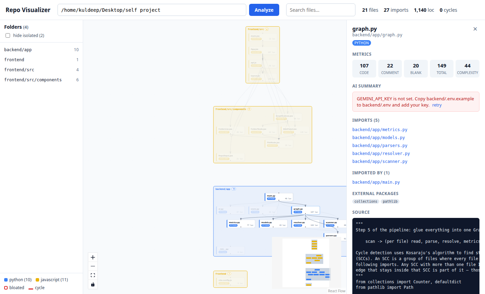

# Repo Visualizer

Point it at any local repository and get an interactive map of how the files import each other,
with per-file metrics, import-cycle detection, and one-click AI summaries.



## Features

- **Dependency graph** of Python, JavaScript/TypeScript and C/C++ files, built by static analysis (no code is executed)
- **Interactive canvas** (React Flow): drag nodes, zoom, minimap
- **Folder grouping**: files sit inside labelled folder boxes; connected files/folders are laid out with dagre, unrelated ones are packed into a grid so a repo of 50 unrelated scripts is a block, not a 50-wide line
- **Navigation**: folder list that zooms to any folder, search that zooms to matches, side-panel links that centre a file, and a "hide isolated files" toggle
- **Metrics per file**: code / comment / blank lines and cyclomatic complexity; oversized files get a red border
- **Import cycle detection** (Kosaraju's strongly-connected-components algorithm); cyclic edges are drawn red
- **Neighbour highlighting**: click a file to fade everything except what it imports and what imports it
- **Side panel** with metrics, imports, importers, external packages and a source preview
- **AI summaries** via Google Gemini, cached in SQLite by file-content hash so unchanged files are never re-sent
- Honours `.gitignore`, skips `node_modules`, virtualenvs, build output and binaries

## Architecture

```
 browser (React + React Flow)                    backend (FastAPI)
 ┌──────────────────────────┐    JSON     ┌────────────────────────────────────┐
 │ RepoInput ─► GraphCanvas │ ◄────────── │ /api/analyze                       │
 │              │           │             │   scanner ─► parsers ─► resolver   │
 │              ▼           │             │        └─► metrics ─► graph (SCC)  │
 │          SidePanel       │ ◄────────── │ /api/file      (source preview)    │
 │                          │ ◄────────── │ /api/summarize (Gemini + SQLite)   │
 └──────────────────────────┘             └────────────────────────────────────┘
```

Backend pipeline, one file at a time:

| Module            | Job                                                                                   |
|-------------------|---------------------------------------------------------------------------------------|
| `scanner.py`      | Walk the repo, prune ignored dirs before descending, apply `.gitignore`, skip binaries |
| `parsers.py`      | Extract imports: Python via the `ast` module, JS/TS and C via regex                   |
| `resolver.py`     | Map `from app.x import y` / `./utils` / `"foo.h"` to a real file, or mark it external |
| `metrics.py`      | Line counts and complexity (`radon` for Python, keyword count for others)             |
| `graph.py`        | Assemble nodes + edges, find cycles with Kosaraju's algorithm                          |
| `ai.py`           | Gemini call behind a content-hash SQLite cache                                        |
| `state.py`        | Remembers the last analysis; `/api/file` only serves ids the scanner produced (no path traversal) |

## Quick start

Requirements: Python 3.11+, Node 18+.

```bash
git clone <this repo> && cd self_project

# backend
python3 -m venv backend/.venv
backend/.venv/bin/pip install -r backend/requirements.txt
cp backend/.env.example backend/.env        # add your free Gemini key (https://aistudio.google.com/apikey)

# frontend
cd frontend && npm install && cd ..

# run both (backend :8000, frontend :5173)
./run.sh
```

Open http://localhost:5173, paste an absolute path such as `/home/you/some-project`, click **Analyze**.
Interactive API docs are at http://localhost:8000/docs.

The AI button works without a key too: it just shows a clear "key not set" message.

## API

| Method | Path             | Body / query          | Returns                                   |
|--------|------------------|-----------------------|-------------------------------------------|
| GET    | `/api/health`    |                       | `{ "status": "ok" }`                      |
| POST   | `/api/analyze`   | `{ "path": "/abs" }`  | `{ root, stats, nodes[], edges[] }`       |
| GET    | `/api/file`      | `?path=src/main.py`   | `{ path, content, truncated }`            |
| POST   | `/api/summarize` | `{ "path": "src/main.py" }` | `{ summary, cached, model }`        |

Node shape:

```json
{
  "id": "src/main.py", "label": "main.py", "path": "src/main.py", "language": "python",
  "loc": { "total": 120, "code": 90, "comment": 10, "blank": 20 },
  "complexity": 7, "bloated": false, "external_imports": ["fastapi", "os"]
}
```

Edges point from the importer to the imported file. Imports that don't resolve to a file in the repo
(standard library, pip/npm packages) are listed in `external_imports` instead of becoming edges.

## Design notes

- **Resolution never touches the disk.** The resolver builds a few candidate paths per import and checks
  them against a set of scanned files, so thousands of imports resolve in milliseconds.
- **Cache key is the content hash, not the path.** Rename a file and its summary stays valid; change one
  character and it is regenerated. API usage scales with how much code changed, not how often you click.
- **Path-traversal guard is an allowlist.** The file and summarize endpoints only accept ids that came out
  of the scanner, so `../../etc/passwd` can never match.
- **Two-level layout.** Each folder's files are laid out on their own (dagre for connected files, shelf-packed grid for
  isolated ones), then the folders are laid out the same way using folder-to-folder imports. This is what keeps
  large, loosely connected repositories readable.
- **Selection never rebuilds the node array.** The canvas maps over React Flow's existing nodes and flips a
  `dimmed` flag, which is why dragged positions survive clicking around.

## Project structure

```
backend/app/     FastAPI app + analysis pipeline
frontend/src/    React app (components/, api.js, layout.js)
docs/            screenshots
run.sh           starts both dev servers
```

## Tech stack

Python 3.12 · FastAPI · Pydantic · radon · pathspec · google-genai · SQLite
React 19 · Vite · @xyflow/react (React Flow 12) · @dagrejs/dagre

## Possible extensions

Collapsible folders, PNG export, Go/Java/Rust parsers, per-function complexity view,
git-blame overlay, dark mode.
